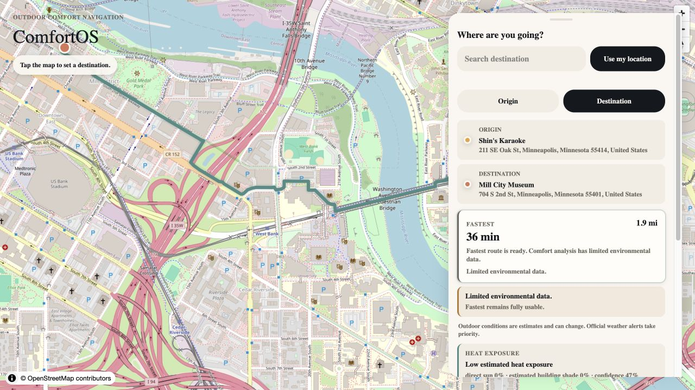

# ComfortOS

ComfortOS is a climate-aware walking route comparison app. It keeps the fastest route available while evaluating alternate candidates for heat, shade, rain cover, wind, and winter exposure.



The current build is the Stage 10 MVP and limited-beta hardening baseline. Managed Mapbox search and walking directions are normalized behind provider interfaces, while deterministic environmental engines calculate route costs independently from the React UI.

## What It Does

- Searches current places and addresses through Mapbox Search Box in managed mode.
- Accepts map clicks, search results, and current location as route endpoints.
- Requests walking route candidates from Mapbox Directions.
- Preserves the fastest route as the dependable baseline.
- Reranks alternate candidates using raw environmental exposure cost.
- Models heat, shade, rain cover, wind, and winter conditions.
- Reports data confidence, completeness, and comparability separately.
- Degrades progressively when environmental data is partial or unavailable.
- Supports time-dependent analysis without embedding calculations in the UI.

Minneapolis, Seattle, and Phoenix are validation scenarios for winter, rain, and heat. They are not hard-coded architecture limits.

## Architecture

```text
Search Provider
    -> normalized suggestions and places
    -> origin / destination

Routing Provider
    -> normalized walking candidates
    -> environmental sampling
    -> shade / rain / wind / heat / winter engines
    -> RouteComfortCost
    -> route selector
    -> Fastest and Comfort presentation
```

The core route-comparison contract is:

```ts
type RouteComfortCost = {
  environmentalExposureCost: number;
  averageEnvironmentalCost: number;
  analyzedDurationMinutes: number;
  confidence: number;
  completeness: number;
  comparable: boolean;
};
```

Provider-specific responses stop at adapter boundaries. Environmental calculations live in engine modules and are covered by deterministic tests.

## Providers

| Capability | Current managed path | Development or fallback path |
| --- | --- | --- |
| Map rendering | MapLibre GL | OpenStreetMap-compatible raster style |
| Place search | Mapbox Search Box v1 | Photon, when explicitly configured |
| Walking routes | Mapbox Directions v5 (`mapbox/walking`) | Public or self-hosted OSRM, when explicitly configured |
| Weather | National Weather Service | Controlled validation fixtures |
| Buildings | Overture query service target | Overpass development adapter |
| Covered features | Configured OSM-derived static data | Unavailable-data degradation |

Managed routing does not silently fall back to public OSRM. Provider metadata is retained so health checks and validation reports can verify which service answered a request.

## Quick Start

Requirements:

- Node.js 22.13 or newer
- npm
- A Mapbox access token for managed search and routing

Install dependencies:

```bash
npm install
```

Create a local environment file:

```bash
cp .env.example .env.local
```

At minimum, configure:

```dotenv
ROUTING_PROVIDER=mapbox-managed
GEOCODING_PROVIDER=mapbox-managed
MAPBOX_ACCESS_TOKEN=your_token_here
WEATHER_USER_AGENT=ComfortOS (contact@example.com)
```

Never commit `.env.local` or an access token. Building and covered-feature providers require additional configuration when those datasets are enabled.

Start the app:

```bash
npm run dev
```

Open [http://localhost:3000](http://localhost:3000).

## Verification

Run the standard checks:

```bash
npm test
npm run typecheck
npm run lint
npm run build
```

Run the Stage 10 smoke gate:

```bash
npm run smoke:stage10
```

The repository also includes focused routing, provider health, latency, climate, fixture, and three-city validation scripts. See the `scripts` section of `package.json` for the complete command list.

## Project Structure

```text
app/                  Next.js routes, API boundaries, and application shell
components/           Map and product UI components
lib/
  comfort/            Route comfort aggregation and scoring
  environment/        Weather and exposure normalization
  geocoding/          Search provider interfaces and adapters
  routing/            Candidate generation, providers, and selection
  shade/              Solar and shade analysis
  wind/               Wind exposure analysis
  rain/               Rain and cover analysis
  heat/               Heat exposure analysis
  winter/             Winter-condition analysis
docs/
  architecture/       Canonical architecture specification
  design/             Product guidelines and approved baseline
  decisions/          Architecture Decision Records
  analysis/           Stage reports and benchmark evidence
  assets/             README and documentation media
scripts/              Health checks, benchmarks, fixture audits, and smoke gates
tests/                Deterministic unit and integration coverage
```

## Product Invariants

- The fastest route remains usable even when environmental analysis fails.
- Missing environmental data must never produce a perfect comfort result.
- Confidence and completeness are distinct signals.
- Routes are compared only when the available evidence is comparable.
- Prototype fixtures are never presented as live observations.
- City-specific validation must not leak into core algorithms.
- Provider credentials remain server-side and must not appear in logs or client bundles.
- Comfort routing augments walking directions; it does not replace a full navigation engine.

## Documentation

Start with the canonical documents:

- [Architecture Specification](docs/architecture/ARCHITECTURE_SPEC_V1.md)
- [Product Design Guidelines](docs/design/DESIGN_GUIDELINES.md)
- [Approved Design Baseline](docs/design/baseline/README.md)
- [ADR-019: MVP Routing Provider Strategy](docs/decisions/ADR-019-mvp-routing-provider-strategy.md)
- [ADR-020: Managed Routing Provider](docs/decisions/ADR-020-mvp-managed-routing-provider.md)
- [ADR-021: Stage 10 Limited-Beta Gate](docs/decisions/ADR-021-stage-10-limited-beta-gate.md)
- [ADR-022: Managed POI Geocoding Provider](docs/decisions/ADR-022-managed-poi-geocoding-provider.md)
- [Stage 9.6 Managed Routing Validation](docs/analysis/STAGE_9_6_MANAGED_ROUTING_VALIDATION.md)
- [Stage 10 MVP Readiness Audit](docs/analysis/STAGE_10_MVP_READINESS_AUDIT.md)
- [MVP Release Checklist](docs/release/MVP_RELEASE_CHECKLIST.md)

The source-of-truth order is architecture specification, product and design guidelines, approved design baseline, ADRs, then implementation code.

## Current Limits

- Environmental exposure is an estimate, not a safety guarantee or medical recommendation.
- The app compares routes but does not provide active turn-by-turn navigation.
- Live weather coverage currently depends on the US National Weather Service.
- Building, shade, and covered-feature quality depends on configured production datasets.
- Map and search providers have their own attribution, retention, quota, and billing requirements.
- Custom graph routing remains outside the current MVP; candidate generation uses provider routes.

## Data Attribution

Map and route data remains subject to the attribution requirements of Mapbox, OpenStreetMap contributors, Overture Maps, and any configured upstream provider. Provider terms must be reviewed before production deployment.
