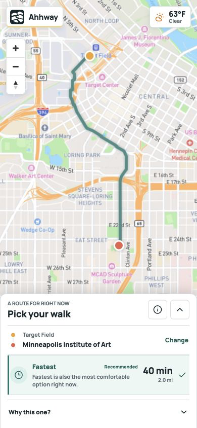

# Ahhway

**Take the nicer walk.** Ahhway is the friendly public face of the ComfortOS Engine. It keeps the fastest route available while evaluating alternate walks for heat, shade, rain cover, wind, and winter exposure.




The public product is named Ahhway; architecture, deterministic calculation modules, and
technical operations retain the ComfortOS name. The current build preserves the Stage 10 MVP and limited-beta hardening baseline while
adding the Stage 11 nationwide environment-service staging candidate. Managed Mapbox search
and walking directions are normalized behind provider interfaces, while deterministic
environmental engines calculate route costs independently from the React UI.

## What It Does

- Searches current places and addresses through Mapbox Search Box in managed mode.
- Accepts map clicks, search results, and current location as route endpoints.
- Requests walking route candidates from Mapbox Directions.
- Preserves the fastest route as the dependable baseline.
- Reranks alternate candidates using raw environmental exposure cost.
- Models heat, shade, rain cover, wind, snowfall, and ice exposure.
- Reports data confidence, completeness, and comparability separately.
- Degrades progressively when environmental data is partial or unavailable.
- Supports time-dependent analysis without embedding calculations in the UI.

Minneapolis, Seattle, and Phoenix are validation scenarios for winter, rain, and heat. They are not hard-coded architecture limits.

## Native Mobile App

The repository includes an Expo SDK 57 iOS and Android client in `apps/mobile`. It is a
native map and location experience, not a WebView wrapper. The mobile client calls the same
normalized Ahhway API while all provider credentials and ComfortOS calculations remain on
the server.

```bash
npm run dev
npm run mobile:ios
```

Use `EXPO_PUBLIC_API_BASE_URL` for the public Ahhway API origin and
`EXPO_PUBLIC_SITE_URL` for policy/support links. Never place Mapbox, R2, or
environment-service credentials in an `EXPO_PUBLIC_*` variable. Android store builds also
need a Google Maps key restricted to the app ID and release certificate. Run the mobile checks
with:

```bash
npm run mobile:typecheck
npm run mobile:test
npm run mobile:doctor
npm --prefix apps/mobile run smoke:api
```

The iOS and Android bundles, live API contract, timeout/cancellation behavior, release config
guards, policy links, and privacy manifest are validated in source. Native device, signing,
store account, screenshot, monitoring, and legal approval gates are tracked in
`docs/release/MOBILE_STORE_RELEASE_CHECKLIST.md`.

## United States Coverage

Place search, managed walking routes, and National Weather Service conditions are eligible
across all 50 states and the District of Columbia. The public `/coverage` page and
`/api/regions` endpoint expose that catalog separately from environmental-data readiness.

The pinned `2026-08-19.0` building release is built, validated, checksum-verified, archived
in R2, and explicitly activated for all 50 states and the District of Columbia. The active
deployment descriptor records 51 jurisdictions, 20,758 stores, and 186,043,651 buildings.
This is nationwide data deployment, not a claim that every feature is available on every
block. Rain-cover data remains a separate capability. Generate bounded state ingestion plans
with:

```bash
npm run data:buildings:plan:states -- --states IL
npm run data:buildings:state -- --plan /tmp/comfortos-us-state-partitions/il/state-plan.json --max-partitions 1 --dry-run true
```

Every real state build requires an explicit `--max-partitions` value so a nationwide data
download cannot begin accidentally.

Terrain, land cover, impervious surface, tree canopy, landform, and pedestrian-surface
sources are pinned separately from the building release. Audit their versions and claim
boundaries with:

```bash
npm run data:environment:sources:audit
```

Run the first bounded USGS 3DEP research pilot with:

```bash
npm run data:terrain:pilot -- \
  --region-config config/data-regions/minneapolis.json \
  --output /tmp/comfortos-terrain-minneapolis
```

These layers do not affect production route ranking yet. ADR-031 requires multi-region
calibration, checksummed deployment artifacts, latency evidence, and a comfort-model version
change before any layer can influence `RouteComfortCost`.

For a resumable, pinned nationwide candidate build, use the smallest-jurisdiction-first
runner. It does not activate or deploy the resulting data:

```bash
npm run data:buildings:rollout -- \
  --plan-root /data/comfortos/plans/2026-08-19.0 \
  --data-root /data/comfortos/overture/us \
  --release 2026-08-19.0 \
  --max-partitions 10 \
  --minimum-free-bytes 8589934592
```

Audit completed candidates separately with `npm run data:buildings:audit`. The audit and
rollout commands also read verified state checkpoints from
`config/data-regions/archive-checkpoints`, so locally pruned states remain complete.

After a state passes live and controlled route validation, archive it to R2 and prune the
local copy only after remote SHA-256 verification:

```bash
npm run data:buildings:archive-state -- \
  --state DC \
  --release 2026-08-19.0 \
  --plan-root data/overture-plans/2026-08-19.0 \
  --data-root data/overture/us \
  --validation-reports /tmp/dc-live.json,/tmp/dc-controlled.json \
  --provider r2 \
  --prune true \
  --confirm-prune DC@2026-08-19.0
```

The command loads R2 credentials from `.env.local` by default, publishes the state archive
manifest last, writes only a compact checkpoint to Git, and never changes production
deployment coverage.

After provisioning a durable deployment volume, preflight the remote manifests, restore the
release, and create an atomic active deployment:

```bash
npm run data:buildings:restore-release -- \
  --release 2026-08-19.0 --states all \
  --checkpoint-root config/data-regions/archive-checkpoints \
  --target-root /data/comfortos --provider r2 --preflight true

npm run data:buildings:restore-release -- \
  --release 2026-08-19.0 --states all \
  --checkpoint-root config/data-regions/archive-checkpoints \
  --target-root /data/comfortos --provider r2 \
  --confirm-restore 2026-08-19.0

npm run data:buildings:activate-release -- \
  --target-root /data/comfortos --release 2026-08-19.0 \
  --deployment-id us-2026-08-19.0-rc1 \
  --confirm-activation us-2026-08-19.0-rc1
```

The environment service then starts with
`ENVIRONMENT_ACTIVE_DEPLOYMENT_MANIFEST=/data/comfortos/deployments/production-active.json`.
See the deployment runbook before restoring the roughly 100 GB release.

The Stage 11 Cloudflare environment service mounts the immutable release read-only from R2
and keeps only the verified catalog in the container image. Nationwide weather and managed
routing/environment integration have passed in all 51 jurisdictions. Runtime monitoring,
signed-client testing, and store release controls remain separate gates.

## Architecture

```text
Search Provider
    -> normalized suggestions and places
    -> origin / destination

Routing Provider
    -> normalized walking candidates
    -> environmental sampling
    -> shade / rain / snow / wind / heat engines
    -> RouteComfortCost
    -> route selector
    -> Fastest and Comfort presentation
```

The core route-comparison contract is:

```ts
type RouteComfortCost = {
  environmentalExposureCost: number;
  averageEnvironmentalCost: number;
  analyzedDurationMinutes: number;
  confidence: number;
  completeness: number;
  comparable: boolean;
};
```

Provider-specific responses stop at adapter boundaries. Environmental calculations live in engine modules and are covered by deterministic tests.

## Providers

| Capability | Current managed path | Development or fallback path |
| --- | --- | --- |
| Map rendering | Web: MapLibre GL with server-proxied Mapbox tiles. Mobile: native Apple Maps/Google Maps | OpenStreetMap-compatible raster style in explicit web development mode |
| Place search | Mapbox Search Box v1 | Photon, when explicitly configured |
| Walking routes | Mapbox Directions v5 (`mapbox/walking`) | Public or self-hosted OSRM, when explicitly configured |
| Weather | National Weather Service | Controlled validation fixtures |
| Buildings | Private environment query service over versioned Overture stores | Local Overture or Overpass development adapters |
| Covered features | Optional private environment query service | Explicit unavailable-data degradation |
| Terrain | USGS 3DEP research pilot; not active in route ranking | No production fallback |
| Land and canopy | Annual NLCD and Forest Service candidates; not active in route ranking | Overture broad vector context only |

Managed routing does not silently fall back to public OSRM. Provider metadata is retained so health checks and validation reports can verify which service answered a request.

## Quick Start

Requirements:

- Node.js 22.13 or newer
- npm
- A Mapbox access token for managed search and routing

Install dependencies:

```bash
npm install
```

Create a local environment file:

```bash
cp .env.example .env.local
```

At minimum, configure:

```dotenv
ROUTING_PROVIDER=mapbox-managed
GEOCODING_PROVIDER=mapbox-managed
NEXT_PUBLIC_BASEMAP_PROVIDER=mapbox-managed
MAPBOX_ACCESS_TOKEN=your_token_here
WEATHER_USER_AGENT=ComfortOS/1.0 (https://your-monitored-contact.example)
```

Never commit `.env.local` or an access token. Building and covered-feature providers require additional configuration when those datasets are enabled.

Start the app:

```bash
npm run dev
```

Open [http://localhost:3000](http://localhost:3000).

## Verification

Run the standard checks:

```bash
npm test
npm run typecheck
npm run lint
npm run build
```

Run the Stage 10 smoke gate:

```bash
npm run smoke:stage10
```

Run the Stage 11 nationwide application gate against a configured release candidate:

```bash
npm run smoke:stage11:nationwide -- --base-url http://localhost:3000
```

Run the 50-state plus D.C. weather and managed-route integration gates:

```bash
npm run weather:validate:nationwide -- \
  --output /tmp/comfortos-nationwide-weather-validation.json

npm run routes:validate:nationwide -- \
  --release 2026-08-19.0 \
  --output /tmp/comfortos-nationwide-integration-validation.json
```

The repository also includes focused routing, provider health, latency, climate, fixture, and three-city validation scripts. See the `scripts` section of `package.json` for the complete command list.

## Project Structure

```text
app/                  Next.js routes, API boundaries, and application shell
apps/mobile/          Expo iOS and Android client
components/           Map and product UI components
lib/
  comfort/            Route comfort aggregation and scoring
  environment/        Environmental exposure engines
    shade/             Solar and building-shade analysis
    wind/              Pedestrian wind exposure analysis
    rain/              Rain and route-cover analysis
    snow/              Snow and ice exposure analysis
    heat/              Heat exposure analysis
  geocoding/          Search provider interfaces and adapters
  routing/            Candidate generation, providers, and selection
  health/             Configuration and bounded live readiness
  map/                Basemap provider configuration
docs/
  architecture/       Canonical architecture specification
  design/             Product guidelines and approved baseline
  decisions/          Architecture Decision Records
  analysis/           Stage reports and benchmark evidence
  assets/             README and documentation media
scripts/              Health checks, benchmarks, fixture audits, and smoke gates
tests/                Deterministic unit and integration coverage
```

## Product Invariants

- The fastest route remains usable even when environmental analysis fails.
- Missing environmental data must never produce a perfect comfort result.
- Confidence and completeness are distinct signals.
- Routes are compared only when the available evidence is comparable.
- Prototype fixtures are never presented as live observations.
- City-specific validation must not leak into core algorithms.
- Provider credentials remain server-side and must not appear in logs or client bundles.
- Comfort routing augments walking directions; it does not replace a full navigation engine.

## Documentation

Start with the canonical documents:

- [Architecture Specification](docs/architecture/ARCHITECTURE_SPEC_V1.md)
- [Product Design Guidelines](docs/design/DESIGN_GUIDELINES.md)
- [Approved Design Baseline](docs/design/baseline/README.md)
- [ADR-019: MVP Routing Provider Strategy](docs/decisions/ADR-019-mvp-routing-provider-strategy.md)
- [ADR-020: Managed Routing Provider](docs/decisions/ADR-020-mvp-managed-routing-provider.md)
- [ADR-021: Stage 10 Limited-Beta Gate](docs/decisions/ADR-021-stage-10-limited-beta-gate.md)
- [ADR-022: Managed POI Geocoding Provider](docs/decisions/ADR-022-managed-poi-geocoding-provider.md)
- [ADR-023: Production Provider Boundaries](docs/decisions/ADR-023-production-provider-boundaries.md)
- [ADR-024: Nationwide Coverage and Partitioned Environmental Data](docs/decisions/ADR-024-nationwide-coverage-and-partitioned-environmental-data.md)
- [ADR-025: Random-Access Building Stores](docs/decisions/ADR-025-random-access-building-stores.md)
- [ADR-026: State Archive and Local Pruning](docs/decisions/ADR-026-state-archive-and-local-pruning.md)
- [ADR-027: R2 Release Restoration and Atomic Activation](docs/decisions/ADR-027-r2-release-restoration-and-atomic-activation.md)
- [ADR-028: Cloudflare R2 FUSE Environment Staging](docs/decisions/ADR-028-cloudflare-r2-fuse-environment-staging.md)
- [ADR-031: Authoritative Environmental Raster Layers](docs/decisions/ADR-031-authoritative-environmental-raster-layers.md)
- [ADR-032: Snow And Ice Comfort Routing](docs/decisions/ADR-032-snow-and-ice-comfort-routing.md)
- [Environmental Data Layers v1](docs/architecture/ENVIRONMENTAL_DATA_LAYERS_V1.md)
- [Environmental Data Foundation Validation](docs/analysis/ENVIRONMENTAL_DATA_FOUNDATION_V1.md)
- [Snow Comfort v1 Validation](docs/analysis/SNOW_COMFORT_V1_VALIDATION.md)
- [Nationwide Weather and Route Validation](docs/analysis/NATIONWIDE_WEATHER_ROUTE_VALIDATION.md)
- [Stage 9.6 Managed Routing Validation](docs/analysis/STAGE_9_6_MANAGED_ROUTING_VALIDATION.md)
- [Stage 10 MVP Readiness Audit](docs/analysis/STAGE_10_MVP_READINESS_AUDIT.md)
- [Stage 10.1 Production Hardening](docs/analysis/STAGE_10_1_PRODUCTION_HARDENING.md)
- [Nationwide Expansion Foundation](docs/analysis/STAGE_10_2_NATIONWIDE_EXPANSION_FOUNDATION.md)
- [Illinois Overture Rollout Pilot](docs/analysis/STAGE_10_3_ILLINOIS_OVERTURE_ROLLOUT.md)
- [Nationwide Data Build Checkpoint](docs/analysis/STAGE_10_4_NATIONWIDE_DATA_BUILD_CHECKPOINT.md)
- [State Archive Pipeline](docs/analysis/STAGE_10_5_STATE_ARCHIVE_PIPELINE.md)
- [Stage 11 Nationwide Data Activation](docs/analysis/STAGE_11_NATIONWIDE_DATA_ACTIVATION.md)
- [MVP Release Checklist](docs/release/MVP_RELEASE_CHECKLIST.md)
- [Environment Query Service Deployment](docs/operations/ENVIRONMENT_QUERY_SERVICE_DEPLOYMENT.md)
- [Observability Runbook](docs/operations/OBSERVABILITY_RUNBOOK.md)

The source-of-truth order is architecture specification, product and design guidelines, approved design baseline, ADRs, then implementation code.

## Current Limits

- Environmental exposure is an estimate, not a safety guarantee or medical recommendation.
- The app compares routes but does not provide active turn-by-turn navigation.
- Live weather coverage currently depends on the US National Weather Service.
- Building, shade, and covered-feature quality depends on configured production datasets.
- Snow Comfort does not know plowing, observed sidewalk ice, accessibility, or safe pavement.
- Map and search providers have their own attribution, retention, quota, and billing requirements.
- Custom graph routing remains outside the current MVP; candidate generation uses provider routes.

## Data Attribution

Map and route data remains subject to the attribution requirements of Mapbox, OpenStreetMap contributors, Overture Maps, and any configured upstream provider. Consumer-facing privacy, terms, data-source, and support routes are included, but final legal review and production publication remain release gates.
