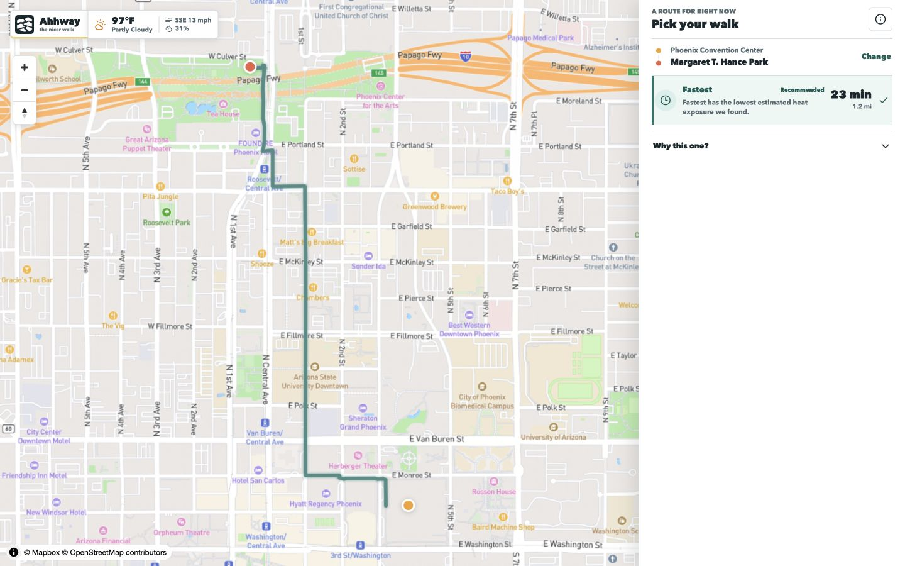
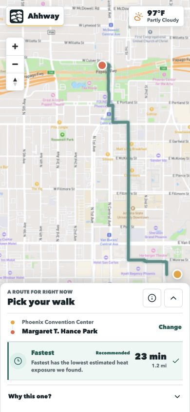
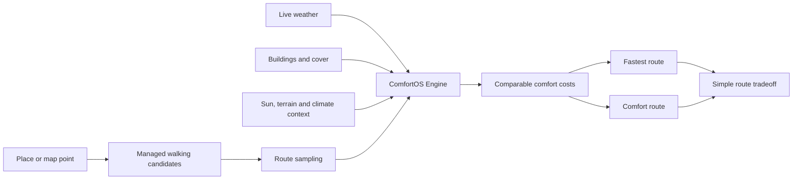

<div align="center">
  

  # Ahhway

  **Take the nicer walk.**

  A weather-aware walking route companion that compares the fastest path with a more comfortable alternative for the conditions outside right now.

  [](https://github.com/Javvvvvvvvvvvva/ComfortOS/actions/workflows/ci.yml)
  
  
  

  **[Open the live app](https://ahhway.javacoding2022.chatgpt.site)** · [See how it works](#how-it-works) · [Read the engineering story](#engineering-highlights)
</div>



## The Idea

Most walking directions optimize one thing: arrival time. But the shortest walk is not always the nicest one.

Ahhway keeps the fastest route visible, then evaluates alternate walks against the environment a person will actually experience: direct sun, building shade, rain exposure, wind, heat, snow, and ice. The interface turns that analysis into a simple tradeoff such as:

> Walk two minutes longer and spend much less time in direct sun.

The consumer product is called **Ahhway**. Its deterministic environmental-analysis and routing platform retains the internal name **ComfortOS Engine**.

## Product Experience

- Search current places and addresses across the United States.
- Use a map point or current location as an endpoint.
- Compare the dependable fastest route with a comfort-ranked alternative.
- Adapt the recommendation to current weather and local climate context.
- Explain the useful tradeoff without exposing a wall of environmental metrics.
- Keep confidence, completeness, and comparability separate from the comfort result.
- Install the web app from a mobile browser and launch it from the home screen.

<table>
  <tr>
    <td width="62%">
      
    </td>
    <td width="38%">
      
    </td>
  </tr>
</table>

## How It Works



Provider responses are normalized at adapter boundaries. React renders product state; it never performs environmental calculations. The engine evaluates route segments deterministically and returns a raw cost contract:

```ts
type RouteComfortCost = {
  environmentalExposureCost: number;
  averageEnvironmentalCost: number;
  analyzedDurationMinutes: number;
  confidence: number;
  completeness: number;
  comparable: boolean;
};
```

Missing data cannot create a perfect score. A route is reranked only when the available evidence supports a meaningful comparison.

## Climate-Aware Routing

Ahhway does not assume that comfort means the same thing everywhere.

| Scenario | Context route | Primary signals |
| --- | --- | --- |
| Phoenix heat | Stay Cool | Direct sun, shade, heat load, humidity |
| Seattle rain | Stay Dry | Precipitation, covered segments, wind |
| Minneapolis winter | Stay Warm | Temperature, wind chill, snow, ice |
| Chicago wind | Avoid Wind | Wind direction, speed, building shelter |

These cities are validation scenarios, not hard-coded product limits. Search, managed walking routes, National Weather Service conditions, and the activated environmental building release cover all 50 states and the District of Columbia.

## Engineering Highlights

- **Nationwide environmental foundation:** 51 jurisdictions, 20,758 spatial stores, and 186,043,651 building features in the pinned release.
- **Provider-safe architecture:** Mapbox search and walking directions remain behind normalized interfaces; credentials stay server-side.
- **Deterministic modeling:** Separate shade, rain, wind, heat, snow, ice, terrain, and comfort modules with repeatable tests.
- **Progressive resilience:** The fastest route remains usable when environmental analysis is partial, slow, or unavailable.
- **Time-dependent analysis:** Sun position and weather context are evaluated for the requested departure time.
- **Responsible scoring:** Confidence and data completeness are explicit and do not inflate route quality.
- **Privacy boundary:** Precise route endpoints use request bodies and are excluded from application logs.
- **Production operations:** Checksummed R2 archives, atomic release activation, health checks, rate limits, and rollback runbooks.
- **Web and native boundary:** The PWA is the public launch surface; the Expo iOS/Android client remains available for a future store release.

## Validation

The project grew through staged research and acceptance gates rather than UI-only prototypes.

- Three-climate routing benchmarks for heat, rain, and winter conditions.
- Live and controlled-route validation in Phoenix, Seattle, and Minneapolis.
- Nationwide weather and managed-routing smoke coverage across 51 jurisdictions.
- Deterministic unit and integration tests for routing and environmental models.
- Secret scanning, TypeScript checks, linting, production builds, mobile bundle audits, and dependency audits in Release CI.
- Explicit production claims and known limits documented in Architecture Decision Records.

Run the release gate locally with:

```bash
npm ci
npm run release:preflight
```

## Technology

| Layer | Technology |
| --- | --- |
| Web product | React 19, TypeScript, Tailwind CSS, Vinext |
| Maps | MapLibre GL, Mapbox tiles |
| Search and routes | Managed Mapbox Search Box and Walking Directions |
| Weather | National Weather Service |
| Spatial analysis | Turf, SunCalc, Overture Maps, USGS source catalog |
| Environmental storage | Cloudflare R2, partitioned spatial stores |
| Persistence | Drizzle ORM, D1-compatible schema |
| Mobile codebase | Expo / React Native |
| Quality | Node test runner, ESLint, TypeScript, GitHub Actions |

## Run Locally

Requirements: Node.js 22.13 or newer and the provider credentials described in [`.env.example`](.env.example).

```bash
git clone https://github.com/Javvvvvvvvvvvva/ComfortOS.git
cd ComfortOS
npm ci
cp .env.example .env.local
npm run dev
```

Open `http://localhost:3000`. Provider credentials and environment-service configuration must remain in `.env.local`; never expose them through public client variables.

## Repository Guide

```text
app/                 Web routes, API boundaries, and policy pages
components/          Product UI and map presentation
lib/comfort/         Deterministic ComfortOS Engine modules
lib/comfort-routing/ Route scoring, policy, explanations, and selection
lib/geocoding/       Normalized search provider adapters
lib/routing/         Candidate generation and routing providers
apps/mobile/         Expo iOS and Android client
config/              Climate profiles and deployed-data manifests
docs/                Architecture, research evidence, ADRs, and runbooks
scripts/             Data lifecycle, benchmarks, audits, and release gates
tests/               Deterministic unit and integration coverage
```

Start with the [architecture specification](docs/architecture/ARCHITECTURE_SPEC_V1.md), [product design guidelines](docs/design/DESIGN_GUIDELINES.md), and [decision records](docs/decisions/README.md). The [PWA release decision](docs/decisions/ADR-036-pwa-first-public-release.md), [nationwide activation report](docs/analysis/STAGE_11_NATIONWIDE_DATA_ACTIVATION.md), and [MVP readiness audit](docs/analysis/STAGE_10_MVP_READINESS_AUDIT.md) contain the main release evidence.

## Honest Limits

- Environmental exposure is an estimate, not a safety or medical guarantee.
- Ahhway compares pre-walk routes; it does not provide background turn-by-turn navigation.
- Building, shade, tree, cover, and sidewalk quality vary by source and location.
- Snow Comfort does not know real-time plowing, observed sidewalk ice, or pavement accessibility.
- Live weather currently depends on United States National Weather Service coverage.
- Custom graph routing is outside this release; candidate generation uses managed provider routes.

## Project Story

Ahhway was designed and built by **Yoonseo Choi** as an end-to-end product and engineering project: concept, visual identity, climate modeling, geospatial data lifecycle, routing experiments, nationwide validation, production hardening, and launch infrastructure.

The goal is simple even when the engine is not: help people choose a walk that feels better outside.

---

Map, route, and environmental data remain subject to the attribution and usage requirements of Mapbox, OpenStreetMap contributors, Overture Maps, the National Weather Service, USGS, and configured upstream providers. See the in-product privacy, terms, support, coverage, and data-source pages for release information.
