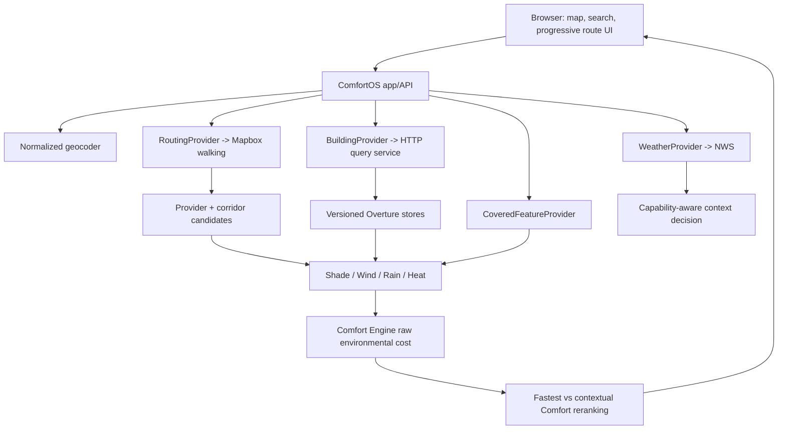

# Stage 10 - Full MVP Readiness Audit

Date: 2026-08-16
Scope: Full limited-U.S.-MVP readiness audit after accepted Stage 9.6

## Executive Decision

```text
READY AFTER P0 FIXES
```

ComfortOS has a credible limited-MVP core: normalized managed walking routing, real NWS and
Overture inputs, deterministic environmental engines, capability-aware context selection,
raw-cost route comparison, an honest progressive Fastest-first UX, and repeatable
three-climate validation. It is not ready to admit external beta users today. The credential
rotation requirement is unverified, several development/public dependencies are not
production-eligible, the building/cover data plane is not deployed, Minneapolis still has a
common >12-second Comfort tail, and launch legal/privacy/monitoring work is incomplete.

The minimum product is intentionally narrower than the design prototype. Active Navigation,
Future Departure, and the consumer Comfort Map are not part of this beta gate.

## Audit Method

The audit read the architecture, product/design sources, approved baseline, production-data
lineage, geographic-expansion documentation, ADR-001 through ADR-020, and the required Stage
3 through Stage 9.6 reports. Runtime code, provider configuration, environment shape, Git
status/history patterns, unit tests, deterministic climate tests, live API calls, a managed
routing benchmark, a four-region smoke run, an 18-route Minneapolis profile, and a real
mobile browser route flow were inspected. Documentation was not treated as runtime proof.

## 1. Current MVP Architecture



Production still uses Stage 5 candidate generation and reranking. Stage 6 edge/custom routing
is research-only. Environmental calculations remain outside React and consume normalized
domain types. Departure time is preserved through route/environment analysis even though
Mapbox walking does not itself provide time-dependent routing.

## 2. Secrets And Security Result

**Result: fail, P0.** The active environment selects `mapbox-managed`, `.env.local` is ignored
and untracked, `.env.example` contains placeholders only, and a repository plus reachable
history pattern scan found no Mapbox public-token pattern outside the ignored environment
file. Health, debug, logs, tests, screenshots, and generated audit artifacts do not serialize
the token. Structured logging drops credential and precise-location fields.

However, the previously used browser-readable Mapbox token remains configured and the audit
cannot demonstrate that it was revoked/rotated. It was previously pasted into a conversation.
Do not reproduce it in tickets or documentation. Before beta, revoke it, create a dedicated
minimum-scope production token, apply restrictions supported by the provider, verify the old
token fails, and enable billing/quota alerts. Mapbox's official
[token security guidance](https://docs.mapbox.com/help/dive-deeper/how-to-use-mapbox-securely/)
should govern that work.

No claim is made about erasing a credential from third-party conversation retention. The
repository itself does not contain it.

## 3. Production Provider Matrix

| Domain | Current provider/mode | Auth | Production eligible now? | Failure/cache/constraint | Replacement boundary |
| --- | --- | --- | --- | --- | --- |
| Geocoding | Photon public demo | none | **No, P0** | generic unavailable state; request cancellation; no-store browser/API; demo may throttle/ban heavy use and gives no availability guarantee | geocoding provider/client boundary |
| Routing | Mapbox Directions API v5, `mapbox/walking`, managed | server token | **Yes after token rotation** | normalized unauthorized/rate-limit/timeout/no-route errors; no automatic public OSRM fallback; provider rate ceiling and account quota apply | `RoutingProvider` |
| Weather | NWS | identifying User-Agent | **Yes after valid contact UA** | five-minute in-process cache on rounded coordinate; current/forecast failures degrade; alerts may fail independently; U.S.-only | `WeatherProvider` |
| Buildings | Overture HTTP query service over local stores | private service boundary not yet implemented | **No, P0 deployment** | partial/limited Comfort on failure; immutable response cache; local process currently loads stores into memory | `BuildingProvider` |
| Covered pedestrian data | disabled in runtime; static OSM extract in research/validation | none | **No for claimed Stay Dry** | honest unavailable capability; local filesystem provider is not worker production shape | `CoveredFeatureProvider` |
| Basemap | OSM community raster tiles | none | **No, P0** | browser tile failures leave degraded/blank context; best effort/no SLA | MapLibre style/source config |

The Photon project's [official README](https://github.com/komoot/photon/blob/master/README.md)
describes its public endpoint as a demo with throttling/banning for extensive use and no
availability guarantee. Production must use a managed geocoder or self-host Photon with
capacity and monitoring.

## 4. Real-Data Lineage Result

| User-visible claim | Application/engine path | Real source | Result |
| --- | --- | --- | --- |
| Temperature/apparent temperature | `EnvironmentSummary` -> `WeatherBundle` -> `NwsWeatherProvider` | NWS observation/hourly forecast | traceable |
| Wind speed/direction | weather UI and Wind engine -> normalized weather | NWS | traceable |
| Rain conditions | Rain/context -> normalized precipitation intensity/probability | NWS | traceable; missing input is not ideal weather |
| Official alerts | alert UI -> normalized alert bundle | NWS active alerts | traceable and separately prioritized |
| Route duration/distance/geometry | route cards -> `RouteResult` -> routing adapter | Mapbox walking | traceable |
| Building shade | shade summary -> solar/shadow geometry over normalized buildings | Overture footprint/height plus timestamp/SunCalc | deterministic estimate, traceable |
| Covered distance | Rain summary -> covered intersection engine | configured normalized OSM-derived extract | traceable when enabled; unavailable in current app runtime |
| Wind exposure | Wind summary -> heuristic urban wind model | NWS wind + Overture buildings + route geometry | deterministic estimate, traceable |
| Heat exposure | Heat summary -> heat engine | NWS weather + shade + bounded wind ventilation + route timing | deterministic estimate, not WBGT/medical risk |
| Comfort Score | UI -> `ComfortAnalysisResult` -> display mapping | deterministic normalized cost/completeness/confidence | traceable; no-data cannot score 100 |
| Comparison percentages/explanations | route presentation -> candidate metric deltas | analyzed real-source candidates | thresholded, real deltas only |

Controlled winter/rain/heat scenarios exist only in `lib/routing-research`, tests, and
explicit validation scripts. Production `app`, `components`, and non-research `lib` do not
import them. ESLint and `tests/production-data-boundary.test.ts` guard fixture/research
boundaries. No design or test fixture supplies a production environmental claim.

One Stage 10 trust fix removed the Minneapolis weather fallback from the initial UI. Without
a selected/current location, the product now says `Select an origin` instead of presenting
real Minneapolis weather as if it were local.

## 5. Three-City Live Validation

Fresh Stage 10 smoke used real managed routing, NWS, and all three real Overture stores:

| Region | Live context | Result label | Fastest | Comfort | Candidates/comparable | Same route | Capabilities |
| --- | --- | --- | ---: | ---: | ---: | --- | --- |
| Minneapolis | balanced | Comfort | 135 ms | 1,381 ms | 5/5 | yes | routing/weather/buildings/shade/wind/heat ready; rain cover unavailable |
| Seattle | balanced | Comfort | 41 ms | 3,203 ms | 5/5 | yes | routing/weather/buildings/shade/wind/heat ready; rain cover unavailable |
| Phoenix | heat | Stay Cool | 34 ms | 765 ms | 5/5 | yes | routing/weather/buildings/shade/wind/heat ready; rain cover unavailable |

The live observations were Minneapolis 26 C, mostly cloudy, 4.63 m/s wind, no alert;
Seattle 23 C, clear, calm, no alert; and Phoenix 42 C, clear, 3.09 m/s wind, one official
alert. The current date therefore produced balanced Minneapolis/Seattle and heat Phoenix;
context was not forced by city. The final Minneapolis browser route displayed Fastest first,
then a valid equal-route Comfort result.

Stage 10 found and fixed a real NWS lineage defect: station observation values with
`wmoUnit:km_h-1` were previously treated as m/s. The final smoke and the full Minneapolis and
Phoenix live reruns occurred after unit-aware normalization. Stage 9.6's 272/272 managed
routing success and controlled-scenario evidence remain valid, but its old live quantitative
wind/Comfort metrics are superseded by Stage 10 where station observations were used.

## 6. Context-Decision Validation

The final deterministic suite covers calm, windy, sunny, and nighttime cold; no rain, light
rain, heavy windy rain, and cover-rich rain; and mild, hot sunny, extreme sunny, late-day
heat, and hot night. It also proves capability-based gating rather than city gating.

Context thresholds are centralized and explainable: cold begins at 4 C ambient, 2 C
apparent, or cold-plus-wind at <=10 C and >=4.5 m/s; meaningful measured rain scales to a
4 mm/h severe point, with probability/condition fallback; heat begins at 32 C ambient or
35 C apparent and scales toward 43 C. Priority multipliers choose one of heat, rain, cold,
or balanced and prevent an impossible simultaneous context. Heavy rain can outrank moderate
heat; extreme heat can outrank light rain. Rain requires usable rain capability and heat
requires usable heat capability. Any location can activate any context from conditions and
capabilities.

These are comfort-selection thresholds, not public safety thresholds.

## 7. Fastest Latency

The fresh managed-routing-only benchmark passed 9/9 requests and returned five candidates
per search:

| Region | Fastest avg | median | sample p95 | max | Full candidate generation avg/max |
| --- | ---: | ---: | ---: | ---: | ---: |
| Minneapolis | 28 ms | 28 ms | 28 ms | 30 ms | 100/143 ms |
| Seattle | 117 ms | 132 ms | 132 ms | 133 ms | 200/232 ms |
| Phoenix | 88 ms | 93 ms | 93 ms | 98 ms | 276/441 ms |
| All | 78 ms | 85 ms | 132 ms | 133 ms | 192/441 ms |

The small-sample percentile is an observed order statistic, not a population guarantee. The
larger accepted Stage 9.6 54-search benchmark likewise had 100% success, 61 ms Fastest
average, 112 ms p95, and 197 ms max. Managed routing is not the Comfort latency bottleneck.

## 8. Comfort Latency By City

| Region/evidence set | Average | p50 | p95 | max | Interpretation |
| --- | ---: | ---: | ---: | ---: | --- |
| Minneapolis, corrected 18-route Stage 10 | 6,832 ms | 3,624 ms | 21,630 ms | 22,931 ms | P0 tail above 12-second UI timeout |
| Seattle, corrected Stage 10 smoke | 3,203 ms | single sample | single sample | 3,203 ms | healthy sample; rain cover unavailable |
| Seattle, accepted managed controlled general runs | 2,489-2,604 ms averages | not retained | not retained | not retained | under warm target; static cover validation path |
| Phoenix, corrected 18-route Stage 10 live | 4,232 ms | 3,327 ms | 8,616 ms | 8,783 ms | 18/18 heat/comparable; within timeout |

The three city rows are not statistically symmetric; this report does not invent missing
percentiles. Future release evidence should use the same full route count in each claimed
primary region.

## 9. Minneapolis P95 Diagnosis

The fresh 18-route run completed 18/18 after Stage 10 stopped generating large environmental
debug GeoJSON collections when debug was disabled. Before that fix, the full run exhausted a
2 GB heap. The result-preserving fix removed the memory failure but not the heavy CPU tail.

Three of 18 routes exceeded 12 seconds after the NWS unit correction: Uptown-Loring
(15.962 s), Powderhorn-Whittier (22.931 s), and North Minneapolis-Downtown (21.630 s).

Stage p95/max evidence:

| Stage | p95 | max | Diagnosis |
| --- | ---: | ---: | --- |
| candidate analysis | 19,917 ms | 21,482 ms | dominant end-to-end path |
| shade accumulated across concurrent candidates | 53,438 ms | 59,847 ms | dominant engine work |
| wind accumulated across concurrent candidates | 32,333 ms | 40,496 ms | second engine bottleneck |
| weather | 3,021 ms | 3,916 ms | meaningful external tail |
| building fetch | 45 ms | 62 ms | not the dominant path |
| reranking | 30 ms | 35 ms | negligible |
| serialization | 0 ms | 0 ms | not the cause after debug omission |

The slow path scales with long/dense route geometry and repeated per-segment shade/wind work
across candidates, not with Mapbox, building I/O, or reranking. Stage 10 does not retune
candidate count or weights to mask it. A measured result-preserving optimization, or a
narrower launch geography that excludes common >12-second paths, is P0.

## 10. Failure-Mode Results

| Failure | Expected/verified behavior | Status |
| --- | --- | --- |
| Missing/invalid routing config | fail before network; no fabricated route | tested |
| Managed routing unavailable/timeout/no-route | normalized category; Walking route unavailable | tested at adapter/service boundaries |
| Public OSRM | cannot activate as automatic fallback from managed mode | verified |
| Weather current/forecast unavailable | Fastest remains; live conditions/Comfort becomes limited as appropriate | tested |
| Alert endpoint unavailable | conditions can remain usable without inventing alerts | tested |
| Building service unavailable | candidates become partial/non-comparable; no ideal empty-scene score | tested |
| Cover disabled/unavailable | `rainCover=unavailable`; no Stay Dry capability claim | tested/live |
| Comfort exceeds 12 s | Fastest stays visible; analysis aborts and late result is ignored | code audited; browser automation remains P1 |
| Geocoder unavailable | manual map selection remains; generic consumer error | code audited |
| Location permission denied | manual search/map path remains | code audited; real-device matrix P1 |
| No internet | no offline routing/weather/tiles; explicit unavailable states vary by subsystem | accepted beta limitation, support copy needed |

One real Stage 10 defect was found and fixed: multi-region Overture lookup previously queried
all stores outside every manifest bbox and returned an empty building set. Empty buildings
could then look like valid low exposure. It now throws an explicit unsupported-region error,
and a regression test covers the boundary.

## 11. Unsupported-Region Behavior

Chicago live smoke proved the intended shape: managed walking routing and NWS remained ready;
the Comfort call returned five candidates but **zero comparable candidates**. Buildings,
shade, wind, and rain cover were unavailable, while heat was partial from ambient weather
without adequate building/shade capability. Fastest remained usable and no Minneapolis,
Seattle, or Phoenix building data was borrowed.

Unsupported areas should communicate that the walking route is available but environmental
coverage is limited. They are not advertised as supported Comfort regions. Partially
supported regions follow the same per-capability logic: missing buildings cannot produce a
confident shade/wind advantage; missing cover cannot activate Stay Dry.

## 12. Accessibility Result

The consumer surface has semantic search, button and pressed-state controls, labeled map
controls, route comparison labels, polite dynamic result regions, assertive official alerts,
and route meaning conveyed through text/borders in addition to color. The bottom sheet is
keyboard-scrollable and manual search avoids a geolocation-only gate.

Stage 10 fixed the primary action contrast from approximately 3.66:1 to approximately
4.84:1 and added a consistent high-contrast 3 px `:focus-visible` ring for buttons, inputs,
and options. Body/secondary text pairs exceed 4.5:1. There are no essential animations, so
reduced motion does not remove information.

Residual P1: manual VoiceOver and complete keyboard-only route testing, production map
keyboard behavior, and Safari/Firefox accessibility validation were not completed. Search
listbox keyboard semantics should be tested with real assistive technology rather than
declared conformant from markup alone.

## 13. Mobile And Browser Result

Chromium in-app testing covered 320x568, 375x812, 390x844, 430x932, and 1280x900. Search
results, focused input, scrollable bottom sheet, live route comparison, equal-route state,
long addresses, and the estimate disclaimer had no horizontal overflow. The final 390x844
route measured body/document scroll width equal to 390 px. Fastest appeared before Comfort,
and no `Start`/fake navigation action remained.

Safari/WebKit and Firefox were not available in the current browser tooling and remain P1
before external beta expansion. Real-device checks are still required for safe areas,
software-keyboard viewport behavior, geolocation permissions, MapLibre rendering, and touch
scrolling.

## 14. Basemap Decision

The current `tile.openstreetmap.org` raster source is development-only and a P0 production
dependency gap. The [OSM tile usage policy](https://operations.osmfoundation.org/policies/tiles/)
describes a best-effort community service with no SLA and potential blocking. ComfortOS must
contract a production tile/style provider or operate a compliant tile service. Visible OSM
attribution stays required when OSM data is shown.

## 15. Geocoder Decision

The Photon public demo is not an MVP production dependency. Select either a managed geocoder
with autocomplete/reverse-geocoding terms appropriate to the expected volume, or self-host
Photon with its own index updates, scaling, health checks, and monitoring. The normalized
geocoding boundary permits this without changing consumer UI or core engines. This is P0.

## 16. Building-Service Deployment Decision

Retain the HTTP `BuildingProvider` boundary and deploy the existing Node query service as a
private supervised service over immutable durable stores for the limited beta. Publish stores
to versioned object storage, stage them onto a read-only service volume, and activate through
an atomic manifest. Measure resident memory and concurrency with all three stores because the
provider currently loads JSONL and tile indexes into memory. `/tmp`, a developer laptop, and
manual filesystem setup are not production architecture.

The full deployment/update/rollback/region-addition runbook is in
`docs/operations/MVP_DEPLOYMENT_AND_DATA_OPERATIONS.md`.

## 17. Routing Cost And Search Economics

The consumer policy uses seven managed route requests: one progressive Fastest, one Fastest
inside comparison, one provider-alternative request, and four corridor attempts. The
comparison response reports six because the initial Fastest is a separate API call.

Using Mapbox's published Directions tiers captured on 2026-08-16 (first 100k requests free,
then $2.00/1k through 500k, $1.60/1k through 1M, and $1.20/1k above 1M until enterprise
pricing), estimated monthly routing API cost is:

| Consumer searches/month | Routing requests | Estimated routing cost |
| ---: | ---: | ---: |
| 1,000 | 7,000 | $0 |
| 10,000 | 70,000 | $0 |
| 50,000 | 350,000 | $500 |
| 100,000 | 700,000 | $1,120 |
| 500,000 | 3,500,000 | $4,600 |
| 1,000,000 | 7,000,000 | at least $6,400 for first 5M plus provider quote for 2M |

At the $2/1k marginal tier, one four-attempt consumer search costs about $0.014 in routing.
Two, three, and four corridor attempts produce five, six, and seven total requests/search,
respectively. No production retune was made for billing. Confirm current rates and account
terms on the [official Mapbox pricing page](https://www.mapbox.com/pricing) before launch.

## 18. Broader MVP Cost Estimate

Provider choices are not final enough for false-precision totals. Routing is the clearest
variable API cost. Environmental CPU is the clearest infrastructure sizing risk.

Assuming two route searches per DAU per day for 30 days:

| DAU | Searches/month | Route requests | Published-tier routing estimate |
| ---: | ---: | ---: | ---: |
| 100 | 6,000 | 42,000 | $0 |
| 1,000 | 60,000 | 420,000 | $640 |
| 10,000 | 600,000 | 4,200,000 | $5,440 |

Add separately: app compute/egress, building service instances and memory, durable/object
storage, production geocoder, production basemap, monitoring/log ingestion, and cover-data
operations. A limited beta budget should use vendor quotes plus a measured building-service
load test. Long shade/wind CPU paths, not store bytes, are likely to dominate Comfort compute.

## 19. Attribution And Licensing Result

Current map attribution is visible. OSM-derived covered data and Overture buildings require
source/release provenance and ODbL review. Overture's
[attribution guidance](https://docs.overturemaps.org/attribution/) calls for attribution that
accounts for Overture and upstream sources; active release metadata must determine final
wording. The [OpenStreetMap copyright page](https://www.openstreetmap.org/copyright) covers
OSM attribution and ODbL. NWS alerts remain identified as official NWS data.

Engineering requirements are documented in
`docs/legal/DATA_ATTRIBUTION_AND_MVP_COPY.md`, but consumer attribution/legal pages and legal
review are P0.

## 20. Privacy And Location-Data Findings

The app currently stores no account, saved route, search history, location history, or
analytics record. Location and route state live in browser memory. Location-derived API
responses use private/no-store cache headers and browser clients use no-store fetches.
Weather has a short ephemeral in-process cache on rounded coordinates.

Third parties still receive data: Mapbox gets route coordinates; NWS gets a weather
coordinate; the geocoder gets search text and possible proximity; the basemap gets tile
requests; hosting/providers can observe IP and request metadata. Building/cover bboxes go to
the privately deployed data service. Structured app logs exclude precise coordinates, but
hosting request-log behavior must be configured and audited.

The exact flow and pre-beta privacy actions are in `docs/privacy/LOCATION_DATA_FLOW.md`.

## 21. Safety-Copy Result

The route result now states: `Outdoor conditions are estimates and can change. Official
weather alerts take priority.` Consumer language uses estimated/relative exposure and avoids
safe, safest, protected, medical risk, and WBGT claims. Official alerts render before normal
route results with assertive semantics. `Stay Cool` and `Stay Dry` are comfort labels, not
safety certifications. Legal/product review of final copy remains P0.

## 22. Active Navigation Launch Decision

**Decision B: hidden.** The prior preview did not have real GPS route progress and could imply
turn-by-turn navigation. Stage 10 removed the `Start` action and preview panel from the
consumer surface. This feature returns only with real position tracking, off-route behavior,
permission/error handling, and clear navigation semantics.

## 23. Future Departure Launch Decision

**Hidden/not launched.** No consumer control is present. It should return only when the chosen
future time drives real NWS forecast selection and complete time-dependent shade/wind/rain/
heat recomputation, with explicit forecast uncertainty and stale-time behavior.

## 24. Comfort Map Launch Decision

**Debug-only/not launched.** Environmental overlays remain available behind explicit debug
query modes for engineering inspection. They are not a consumer flagship until provenance,
legend/uncertainty, performance, accessibility, and product comprehension are validated.

## 25. Launch Geography Recommendation

**Option C: three regions as beta/preview, one primary.** Recommend Phoenix as the initial
primary region after shared P0 infrastructure/legal/security work because its corrected full
18-route managed live heat suite activated heat on 18/18 comparable routes and stayed within
the 12-second timeout. All 18 current live searches validly kept Fastest as Stay Cool;
controlled heat suites retain deterministic reranking evidence without forcing a difference.
Minneapolis has excellent cold/wind model evidence but remains preview
until the >12-second common Comfort tail is fixed. Seattle remains preview: the Rain Engine is
valid, but route-accessible covered data is sparse and the cover provider is not production
deployed.

This is a launch recommendation, not an architecture constraint. Region claims derive from
capabilities, not city names.

## 26. Feature Readiness Matrix Summary

| Feature | Minneapolis | Seattle | Phoenix | Launch ready? |
| --- | --- | --- | --- | --- |
| Fastest | validated | validated | validated | yes after shared provider/security P0s |
| Comfort context | validated; latency tail | validated balanced/general | validated | beta after P0s |
| Stay Warm | controlled/live architecture valid | condition-capable, not regional claim | condition-capable, not regional claim | Minneapolis preview until latency fix |
| Stay Dry | condition-capable; no cover | valid engine, sparse cover, provider disabled | condition-capable; no cover | no broad launch claim |
| Stay Cool | condition-capable | condition-capable | corrected full live/controlled validation | Phoenix beta after P0s |
| Future Departure | hidden | hidden | hidden | no |
| Active Navigation | hidden | hidden | hidden | no |
| Comfort Map | debug-only | debug-only | debug-only | no |

## 27. P0 Blockers

1. Revoke/rotate the previously exposed Mapbox token; configure a dedicated restricted token
   and quota/billing alerts.
2. Replace Photon public demo and OSM community raster tiles with production-eligible
   services.
3. Configure a valid monitored NWS User-Agent/contact.
4. Deploy the building query service with durable versioned stores, private access, health,
   capacity evidence, and rollback.
5. Either deploy reviewed covered-feature data for Seattle claims or keep Stay Dry/Seattle
   explicitly unavailable/preview.
6. Fix common Minneapolis >12-second Comfort paths without changing results, or exclude those
   paths/region from the primary launch scope.
7. Publish legally reviewed privacy, terms, attribution, estimate/disclaimer, and contact
   surfaces; configure provider/platform retention and redaction.
8. Centralize production errors/metrics sufficiently to detect routing, data-service, engine,
   timeout, and quota failures before admitting beta users.
9. Make production `/api/health` ready and pass the release smoke/build/data rollback gates.

## 28. P1 Issues

- Current Safari/WebKit and Firefox plus real-device geolocation/safe-area/keyboard testing.
- Manual VoiceOver and full keyboard-only route flow.
- Automated stale-request and 12-second UI-timeout browser coverage.
- Production bundle/chunk budget and debug-surface exclusion evidence.
- Reviewed operational log retention, dashboards, incident ownership, and rollback rehearsal.
- Symmetric full route latency samples for Seattle and Phoenix on the final deployment.
- Consumer support copy for offline/no-network and supported browsers.

## 29. P2 Accepted Limitations

- Fastest and Comfort may be the same route; this is a valid `Best choice right now` result.
- Climate contexts activate only when current conditions warrant them.
- Seattle covered-route differentiation is sparse and must be described as preview/limited.
- Unsupported U.S. locations may have Fastest and weather but no comparable environmental
  route.
- No offline routing, cached route history, accounts, analytics SDK, or active navigation.
- Models estimate comfort/exposure from available data; they do not certify safety.
- No tree canopy, snow/ice, AQI, WBGT, or fourth climate engine.

P3 opportunities include provider diversification, worker-native spatial storage, richer
covered-data sources, measured tree/solar data, custom Stage 6 routing research, saved routes,
and active navigation after the limited MVP proves demand.

## 30. Release Checklist Status

The authoritative checklist is `docs/release/MVP_RELEASE_CHECKLIST.md`. It is currently
blocked. Stage 10 baseline engineering evidence is checked, while security rotation,
production dependencies, deployment, legal/privacy, monitoring, Minneapolis latency, and
cross-browser release gates remain open.

## 31. ADR And Documentation Changes

Created:

- `docs/decisions/ADR-021-stage-10-limited-beta-gate.md`
- `docs/release/MVP_RELEASE_CHECKLIST.md`
- `docs/operations/MVP_DEPLOYMENT_AND_DATA_OPERATIONS.md`
- `docs/privacy/LOCATION_DATA_FLOW.md`
- `docs/legal/DATA_ATTRIBUTION_AND_MVP_COPY.md`
- this Stage 10 audit

Runtime hardening added capability derivation, cheap combined readiness, structured
location-safe server logs, private/no-store location responses, production debug omission,
unsupported-region store guards, honest no-origin weather UI, a repeatable Stage 10 smoke
script, unit-aware NWS observation wind normalization, and deterministic climate/hardening
regression tests. ADR-021 records the narrowed beta product and launch gate.

Final verification passed 186/186 tests, TypeScript, ESLint, production build, and
`git diff --check`. The build emitted a 969 KiB minified `ComfortOSApp` client chunk warning;
research-scenario markers were absent from the client bundle. Bundle splitting is P1. The
Vinext experimental-glob and dynamic-route classification notices are current tooling
limitations and did not prevent a complete build.

## 32. Final Judgment

```text
READY AFTER P0 FIXES
```

Minimum exact work is the nine P0 groups in section 27, completed against a
production-equivalent release candidate and checked in the release checklist. The underlying
three-climate MVP architecture is valid; the unresolved work is bounded productionization,
performance, and trust/operations work rather than a new engine or routing architecture.

Do not begin Stage 11 or another post-MVP stage from this audit.

## Acceptance-Criteria Ledger

| # | Criterion | Result |
| ---: | --- | --- |
| 1 | security/credential audit passes | **blocked: rotation not demonstrated** |
| 2 | production/research boundaries verified | pass |
| 3 | data lineage traceable | pass |
| 4 | production provider readiness audited | pass; gaps are P0 |
| 5 | unsupported-region behavior defined | pass |
| 6 | context regression-tested | pass |
| 7 | three-city live validation passes | pass |
| 8 | core UX audited | pass |
| 9 | progressive Fastest/Comfort robust | pass with timeout automation P1 |
| 10 | major failure states tested | pass at unit/service/smoke boundaries |
| 11 | latency fully profiled | pass |
| 12 | Minneapolis p95 classified/fixed or blocker | P0 blocker classified |
| 13 | attribution/licensing documented | pass; legal review open |
| 14 | privacy/location flow documented | pass |
| 15 | accessibility audited | pass with manual AT P1 |
| 16 | mobile/browser audited | Chromium pass; Safari/Firefox P1 |
| 17 | production topology defined | pass |
| 18 | basemap suitability decided | pass: replace for production |
| 19 | geocoder suitability decided | pass: replace/self-host |
| 20 | building-store deployment decided | pass: durable versioned service |
| 21 | cost model exists | pass |
| 22 | launch geography recommendation exists | pass: Option C |
| 23 | feature matrix exists | pass |
| 24 | P0/P1/P2/P3 list exists | pass |
| 25 | release checklist exists | pass |
| 26 | tests/typecheck/lint/build pass | pass: 186 tests plus typecheck/lint/build/diff check |

Stage 10 itself is complete as an audit with an explicit blocked release gate. A criterion
marked blocked is not silently converted into a pass; that is why the judgment is not
`READY FOR LIMITED MVP BETA`.
