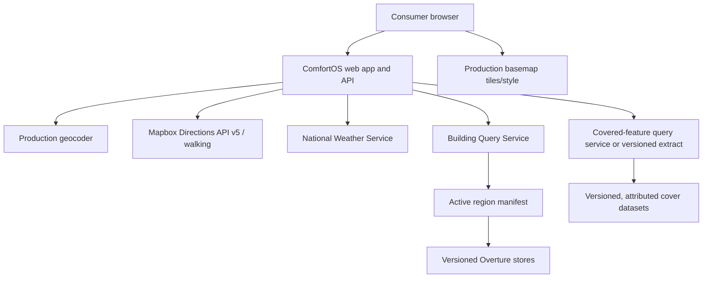

# ComfortOS MVP Deployment And Data Operations

Date: 2026-08-16
Status: Stage 10 production proposal; deployment not yet complete

## Intended Topology



The application runtime owns orchestration, normalized provider boundaries, environmental
engines, context selection, and route comparison. Provider-native schemas stop at their
adapters. The browser never receives routing credentials or direct building-store access.

## Development Versus Production

| Concern | Current development validation | Required production shape |
| --- | --- | --- |
| App | Vinext local dev server | versioned app deployment with secrets manager |
| Routing | managed Mapbox, server-side token | same adapter, dedicated restricted token, quota alerts |
| Geocoder | Photon public demo | managed geocoder or self-hosted Photon with capacity/SLA |
| Weather | NWS | NWS with identifying contact User-Agent, timeout and cache |
| Buildings | Node HTTP service over `/tmp` stores | supervised service over immutable durable stores |
| Covered data | disabled in app; local static extract in validation | worker-compatible query path and versioned source package |
| Basemap | OSM community raster tiles | contracted/managed production tiles or self-hosted tiles |
| Logs | structured stdout | centralized logs, alerting, and retention controls |

`/tmp` is validation storage only. It must never be the source of truth in production.

## Building Query Deployment Decision

Use the existing HTTP boundary for the limited MVP. Deploy the Node query service as a
separate supervised container or VM process with the following properties:

- Read-only store volume populated from versioned object-storage artifacts.
- One active manifest mapping a capability region to a store release.
- All three validated stores loaded by the same `MultiRegionOvertureBuildingProvider`.
- `/health` for process/store readiness and `/metadata` for non-secret provenance.
- Private network access from the app API; TLS and service authentication at the platform
  boundary.
- At least two instances or a documented rapid-restart policy for beta.
- Memory sized from a measured all-store resident-set benchmark. The current provider loads
  `buildings.jsonl` and its tile index into process memory on first use, so the deployment
  must not be sized from file size alone.
- Request timeout, concurrency, payload-size, and bbox-size limits at the service edge.

The current stores are:

| Capability region | Overture release | Buildings | Validation storage |
| --- | --- | ---: | --- |
| Minneapolis | `2026-06-17.0` | 97,494 | local `/tmp` store |
| Seattle | `2026-07-22.0` | 117,331 | local `/tmp` store |
| Phoenix | `2026-06-17.0` | 51,737 | local `/tmp` store |

The mixed release set is acceptable for validation but must be deliberate and visible in
the production active manifest. A synchronized release is preferred when it passes the
same validation gates.

## Versioned Store Layout

Recommended object-storage layout:

```text
comfortos-environment-data/
  overture-buildings/
    <release>/
      <region-id>/
        manifest.json
        buildings.jsonl
        tile-index.json
        checksums.json
  covered-features/
    <source-release>/
      <region-id>/
        covered-features.geojson
        manifest.json
        checksums.json
  deployments/
    production-active.json
```

`production-active.json` is changed atomically. Store artifacts are immutable after
publication. The previous active manifest remains available for rollback.

## Dataset Update Runbook

1. Choose and record the upstream Overture release.
2. Run ingestion against a tracked `config/data-regions/<region>.json` bbox.
3. Validate manifest schema, checksums, geometry validity, counts, height provenance, and
   region bbox.
4. Run provider bbox tests and the region route suite against the new store.
5. Compare completeness, confidence, latency, and route-selection deltas with the active
   release.
6. Upload under a new immutable release path.
7. Deploy to a staging query service and run `/health`, `/metadata`, and Stage 10 smoke.
8. Atomically update the active manifest.
9. Monitor provider failures and comparison latency.
10. Roll back the manifest if gates regress. Never replace active files in place.

## Covered-Feature Update Runbook

Covered pedestrian data has stricter semantic gates than building data. A feature must have
pedestrian relevance, traversability/access evidence, and actual overhead-cover evidence.
Transit-area or sidewalk presence alone is not cover evidence.

For each refresh, preserve source feature IDs/tags, extraction date, source URL, query,
license/attribution, eligible/restricted counts, and route-accessible coverage quality. Run
both the Seattle general sample and cover-rich sample before activation.

## Adding A Region, Such As Chicago

1. Add a region config containing an ID, bbox, label, and validation notes.
2. Ingest an Overture store with the existing generic command.
3. Add covered data only when defensible source coverage exists.
4. Publish immutable artifacts and add the region to the active manifest.
5. Run provider, environmental completeness, latency, and route-quality suites.
6. Verify live weather/routing and controlled context behavior independently.
7. Mark capabilities `ready`, `partial`, or `unavailable` from evidence.
8. Activate the capability region without changing shade, wind, rain, heat, comfort, or
   routing algorithms.

No city-name branch is permitted in a core engine or context decision.

## Health And Rollback

- `/api/health` is a cheap configuration readiness check. It does not call paid or slow
  upstream providers.
- `/api/routes/routing-health` is a live managed-routing probe and should run on a bounded
  schedule, not on every platform health poll.
- Building `/health` verifies the process and store metadata.
- Deployment readiness requires app, routing configuration, weather User-Agent, building
  service, cover configuration for claimed rain capability, geocoder, and basemap to be
  production-eligible.
- A failed environmental dependency must preserve Fastest where managed routing works.

Rollback order is application version, active environment-data manifest, then provider
configuration. Keep the prior two known-good app and data versions available during beta.

## Observability

Centralize the structured events already emitted by the API. Alerts should cover:

- routing, weather, building, cover, or environment failure-rate spikes;
- Fastest p95 and Comfort p50/p95 by coarse capability region;
- Comfort timeout/limited-data rates;
- candidate count and routing requests per consumer search;
- building service health, memory, restarts, and response size;
- Mapbox quota and billing thresholds.

Do not log precise origin/destination coordinates, route geometry, access tokens, raw
authorization headers, or provider error bodies. Set a reviewed operational-log retention
period before external beta.
